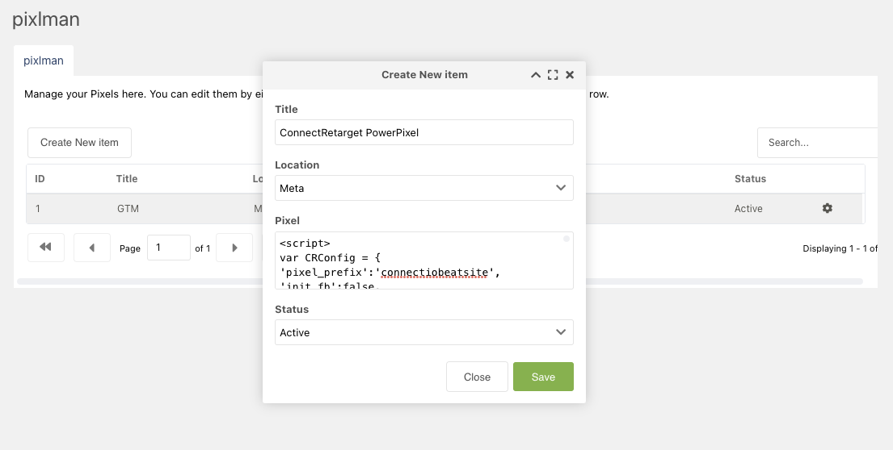

# MODX Pixel Manager

> A MODX Extra to manage "Pixels", 3rd Party plugin embeds or general javascripts

 - Choose "Meta", "Header", or "Footer" locations for the "pixel"
 - Auto-generated `<!--` comments for organization

*Tested in MODX3 Beta2

## Download the latest package and upload via Manager install

